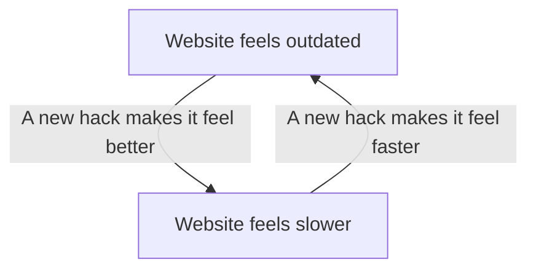

import { GlobalInitialization } from '@widgets/global-initialization'
import { Initialization } from '@content/widgets/initialization'
import { PageAssets } from "@content/widgets/page-assets"
import { GameOfLife } from "@content/widgets/game-of-life"

There is nothing in this world better than a good graph. Seeing a diagram that gets the point across without noise, clutter? A good palette? *Ooooohohoho*, there's nothing better. We really are in a golden age of diagrams, and I want this site to be the premier place to contribute as best I can to the era.

It's not that I haven't done my best so far — I'm particularly proud of the diagrams for, say, [[public/content/articles/structured-streaming|structured streaming]] and [[public/content/annotations/college-admissions-and-the-stability-of-marriage|Gale-Shapley]] (and less proud of, say, [[public/content/notes/supply-chain|supply chains]] or [[public/content/articles/littlefield|production engineering]]). What irks me is the lack of interactivity I've been able to give them — so far.

Interactivity is an absolute boon. Really great visualizations — things that you'd see from, say, [The New York Times' *What's Going On in This Graph?*](https://www.nytimes.com/column/whats-going-on-in-this-graph), or the wonderful [Red Blob Games](https://www.redblobgames.com/) — often come with the ability to highlight, explore, really *touch* the data. It's not a hard pre-requisite — [Our World in Data](https://ourworldindata.org/) is an amazing visualization shop that outputs static graphs, no doubt because they share better on social media — but for a data-curious audience, nothing beats a tactile feel to the data.

The stopper is that these interactive diagrams are just plain harder to pop into a webpage. It's easy enough to `CTRL-C`, `CTRL-V` an image of a graph into a webpage — it's far harder to render the code in a way that isn't a nightmare. Trying to get this working is the most common cause of death for the blog sites I've put together. The first Gatsby site, then the [[public/content/notes/digital-gardening-with-quartz|original Quartz run]], followed by knock-on Gatsby 2, Astro, Gatsby 3, and — now — this site, here. It requires a lot of under-the-hood fuckery with the way the content is rendered. It requires strong [[public/tags/seasons/systems/index|systems]] that the rest of the site can be built around.

But now? I think I've finally got a pattern down! Without further ado: **Quartz Widgets!**

<GlobalInitialization />

<Initialization />

## Quartz Widgets & MDX

On the surface, the problem doesn't seem too tricky to work around. Many sites are written using **Markdown**, which is a clean way to write formatted text without needing to worry about things like the frustrating interfaces of document software like, say, Microsoft Word. More or less, you can just pop open the literal Notepad app on your computer and just start typing — no setup required. It makes it easy to separate out the "run a website" part of the process from the "writing" part. Even [this post](https://raw.githubusercontent.com/chaoticgoodcomputing/chaoticgoodcomputing.github.io/refs/heads/main/content/public/content/notes/mdx-widgets-test.mdx) is something you could download and read as a normal file.

Markdown has a lesser-known, still-delightful cousin called [MDX](https://mdxjs.com/docs/what-is-mdx/#what-is-mdx). MDX's goal is to have a foot on both sides of the fence: be primarily for writing, but have a bit of extra *oomph* under-the-hood to allow for website code to live alongside your writing. The problem? Just because something works with Markdown, doesn't mean it'll work with MDX.

### Cutting wires, crossing fingers

We're all pretty familiar at this point with the *world wide web*. You go to a website, it loads, you read it. You realize it's AI slop, you go back, you try again — a modern twist. Over time, though, a lot of work has been done to make websites look, and feel, the way they do today. There's a stark difference between something like [the 1996 Space Jam website](https://www.spacejam.com/1996/jam.html) and your modern social media website.

I'm no web historian. My understanding of the last, say, 3 decades of web development is:

There's a ridiculous amount of infrastructure in modern web development that can't be seen *at first glance*, all dedicated to making everything faster so that *you, the developer,* can make things look prettier. This is what people are typically referring to when they use the term **web framework** — many slick hacks tied together to try and separate out "making a website" from "making a website that runs well." It isn't until you either need to speed things up, or add new core functionality, that you run smack-dab into all of the little hacks folks have come up with over the years sitting under the hood.

### Quartz, Hydration, and a Big Ol' Postscript

[Quartz](https://quartz.jzhao.xyz/), the web framework that this site is built on, is fantastic. The premise is simple — if you use something like [Obsidian](https://obsidian.md/) to write your notes in Markdown, all you've got to do is plug it in and it'll spit out a website for you. It's got enough [built-in configuration](https://quartz.jzhao.xyz/configuration) that, if your goal is to minimize the time between "I want to publish a website" and "I *have* published a website", it's an awesome way to go.

If you want to get real deep under-the-hood, though, you'll need to go under the hood.

Thankfully, the documentation for Quartz (which uses Quartz — that's neat!) is *incredibly* well thought-out. The [architecture document](https://quartz.jzhao.xyz/advanced/architecture) is the place to go to figure out how MDX can be implemented. There's a couple pieces from that documentation that flag trouble ahead:

> **On The Client:**
> Once the body is loaded, the browser loads the non-critical JS (emitted to `public/postscript.js`)

In context: when the website is built, all of the JavaScript code — the code that makes interactive things like the graph, explorer, etc. — gets shoved into one big file. For a normal Quartz site, this is actually an optimization! For things that will actually *show up* on every page, it means that the user's computer only needs to download the script once. After that, every other page will load faster because all the code needed to run those are already saved to the user's computer.

The rough part? This doesn't give us a lot of wiggle room for per-page code. MDX's whole thing is that you can include some code in one post to make it interactive. Following Quartz's [guide for writing your own components](https://quartz.jzhao.xyz/advanced/creating-components), all of the inline JavaScript for a component is gonna get tossed into that `postscript.js` and loaded when users visit your site for the first time — even if the user never actually visits the page your MDX component is on.

<PageAssets />

Above is an MDX widget that will calculate the data your browser had to download to visit this page. There's a few different categories of files, but the ones we're talking about here are the **`postscript.js`** and Widget Scripts entries. That's a live total (which will either be about the same, or much worse, than it is now). As of writing, though, I've got:

![[assets/Pasted image 20260115164005.png]]

(In case you didn't believe me when I said all that stuff about everything behind-the-scenes that makes websites pleasant to visit: the **Article** entry is how much of this page contains the actual text of this post. Looking good takes a lot of data.)

The problem child, here, is the ratio between Widget Scripts and `postscript.js` . On the face of it, this isn't too bad — a ratio of ~1:10 means the widgets for this page are pretty small.

Remember, though — in Quartz's out-of-the-box system, anything I put in here would *always* load when you first visit the website. An extra 20KB isn't bad, but if I were to redo something like the [[public/content/articles/littlefield|Littlefield]] post with live graphs, those end up being about 50KB apiece. Publishing the graphs for the data behind [[public/tags/projects/flowthru/index|flowthru]] and [[public/tags/projects/games/magic-atlas/index|MagicAtlas]] will get up there in the ~3MB range.

Blowing up the size of the `postscript.js` — effectively slowing down how long your site takes to load the first time — isn't *horrible* on modern internet connections and device speeds, but it also isn't *good.* The downside is twofold:

1. People don't like waiting for websites to load. On my current coffee shop WiFi (0.6 MB/s), the site takes a second to download, and then about three more to actually execute the code for the first time.
2. Search engines *hate* waiting for websites to load. That's part of how they measure the quality of a site — and judge whether or not they'll even show users your site in the coveted first page of search results.

Chrome's [Lighthouse](https://developer.chrome.com/docs/lighthouse/) utility is a good way to test how graciously the algorithmic overlords running our search engines will treat your site. For the actual Quartz website, the review is like we said before— not *horrible*, but not *great*:

![[assets/Pasted image 20260115170012.png]]

Evaluating the current performance of this site, though, show's that I have already made this `postscript` problem worse with my changes to the Graph and Explorer components. From what I can tell, I caused an emulated Moto G Power commit suicide:

![[assets/Pasted image 20260115170136.png]]

## Workaround & Results

The workaround I ended up going with — and I won't get too far into it — was twofold:

1. Replacing the underlying Markdown engine with [`remark-mdx`](https://mdxjs.com/packages/remark-mdx/) as a new `transformer` plugin, which isn't fun, but wasn't bad.
2. Creating two custom `emitter`s — one for properly handling the conversion of the JavaScript in MDX files into web components that could be targeted by scripts, and another emitter to determine what additional widget scripts are necessary for a given page when the user clicks on it.

If this system feels like it works without a whole lot of maintenance, I may contribute it back upstream to the original Quartz project if folks seem interested. Obsidian is admittedly not the friendliest for MDX files — before gauging the upstream interest, I may accompany this with a more up-to-date Obsidian MDX plugin.

In case this does end up upstream at some point, this system has two parts in my actual code:

1. Quartz widgets, which are built into the actual `quartz` engine, for things that seem universally helpful like inline PDF viewers (similar, but not as custom, as the components used for [[public/tags/writing/annotations/index|annotations]]).
2. Site widgets, which live in the actual Obsidian vault, and are custom to my website.

## Next Up

<GameOfLife 
  initialState={[
    [0,0,1,1,1,0,0,0,1,1,1,0,0],
    [0,0,0,0,0,0,0,0,0,0,0,0,0],
    [1,0,0,0,0,1,0,1,0,0,0,0,1],
    [1,0,0,0,0,1,0,1,0,0,0,0,1],
    [1,0,0,0,0,1,0,1,0,0,0,0,1],
    [0,0,1,1,1,0,0,0,1,1,1,0,0],
    [0,0,0,0,0,0,0,0,0,0,0,0,0],
    [0,0,1,1,1,0,0,0,1,1,1,0,0],
    [1,0,0,0,0,1,0,1,0,0,0,0,1],
    [1,0,0,0,0,1,0,1,0,0,0,0,1],
    [1,0,0,0,0,1,0,1,0,0,0,0,1],
    [0,0,0,0,0,0,0,0,0,0,0,0,0],
    [0,0,1,1,1,0,0,0,1,1,1,0,0]
  ]}
  verticalPadding={3}
  height={400}
  secondsPerFrame={0.3}
/>
(Preview of the Game of Life widget for the published version of [[public/content/annotations/clinard-dissertation|a friend's dissertation]].)

I'm super excited to have a solid platform that helps get things looking, and feeling, like I intend. Expect lots more graphs, and notes from [[public/tags/engineering/data/index|data projects]], now that I can share them in a format that feels best!