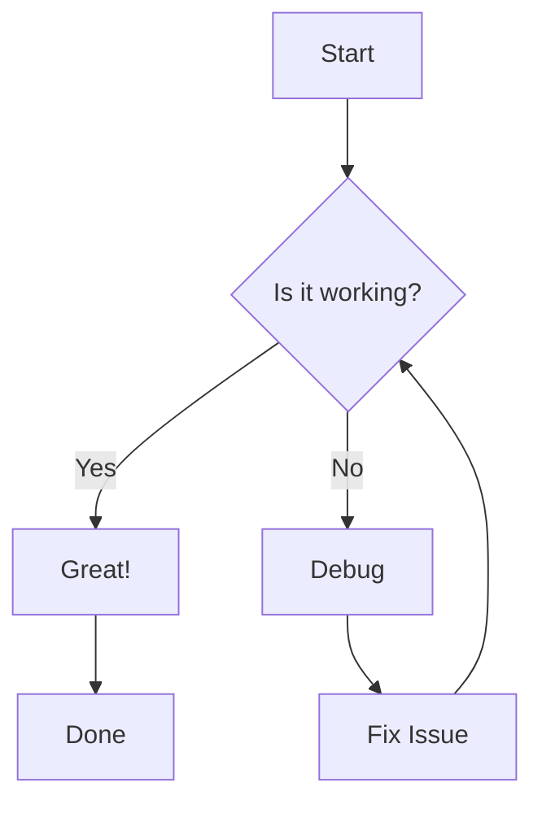
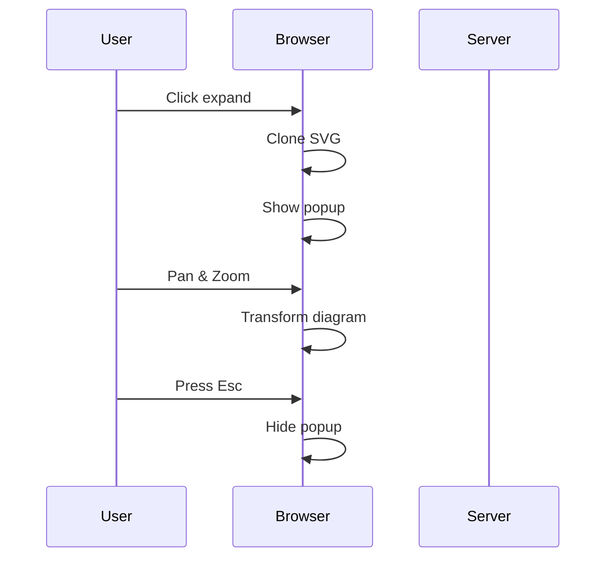
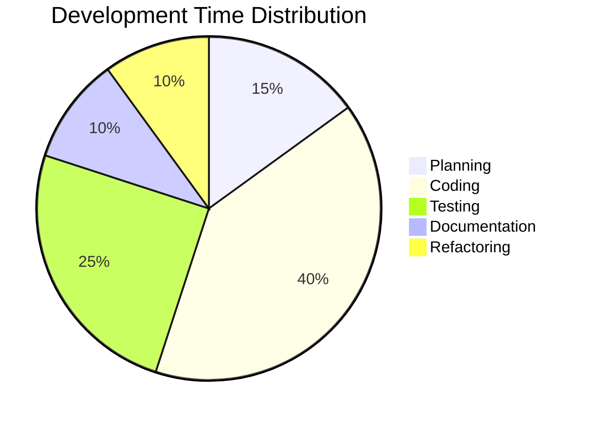

Chaotic Good Computing is an organization specializing in providing advice and assistance for small companies around:

- Software Engineering
- Data Analysis & Handling
- Economic Analysis

CGC's general specialty is [[tags/engineering/index]], analysis, insights, and maintenance of [[tags/economics/index|digital economies]] like multiplayer game economies, network and cloud resource optimizations, or other digital spaces where you'd find a whole lot of chaos and complications.

This site contains articles, notes, and thoughts on a broad range of topics. [[tags/articles/index|#articles entries]] are great points to get started!

## Feature Tests

### Callouts

> [!info]+ Collapsible Callout
> This is a collapsible callout that tests the callout inline script functionality.
> - It should be able to collapse and expand
> - The state persists across page navigation

> [!warning]- Collapsed by Default
> This callout starts collapsed (note the `-` after the callout type).
> Click the title to expand it!

> [!note] Regular Callout
> This is a regular, non-collapsible callout for comparison.

### Checkboxes

Interactive checkboxes with persistent state:

- [ ] First task - try checking this!
- [ ] Second task - state persists in localStorage
- [ ] Third task - survives page navigation
- [x] This one starts checked

### Code Clipboard

Click the copy button on any code block to copy its contents:

```typescript
function greet(name: string): string {
  return `Hello, ${name}!`
}

const message = greet("World")
console.log(message)
```

```bash
# Shell commands can also be copied
npm install
npm run build
npm start
```

### Mermaid Diagrams

Interactive mermaid diagrams with pan, zoom, and expand functionality:






