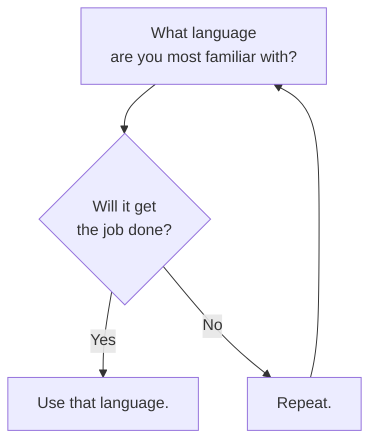

I'm certainly not a person who has [[content/notes/strong-and-weak-opinions|strong opinions]] about programming languages. My personal and professional decision graph around language choice is:

That said, I do break out languages according to the task:

| The Job                                                           | The Languages                                                                                                                                                                                       |
| ----------------------------------------------------------------- | --------------------------------------------------------------------------------------------------------------------------------------------------------------------------------------------------- |
| **[[tags/projects/index\|Application development]]**              | [[tags/engineering/languages/csharp/index\|.NET]] and [[tags/engineering/languages/typescript/index\|TypeScript]] (stack used for my [[tags/projects/dayjob/index\| day job]])                      |
| **[[tags/engineering/data/index\|Data science and engineering]]** | [[tags/engineering/languages/python/index\|Python]] and/or [[tags/engineering/languages/csharp/index\|.NET]] (via [[tags/projects/flowthru/index\|Flowthru]])                                       |
| **[[tags/projects/games/index\|Game development]]**               | [[tags/engineering/languages/typescript/index\|TypeScript]], [[tags/engineering/languages/csharp/index\|.NET]], and [[tags/engineering/languages/lua/index\|Lua]]                                   |
| **[[tags/engineering/frontend/index\|Web development]]**          | [[tags/engineering/languages/typescript/index\|TypeScript]] and/or [[tags/engineering/languages/csharp/index\|.NET]] (via [Blazor](https://dotnet.microsoft.com/en-us/apps/aspnet/web-apps/blazor)) |

